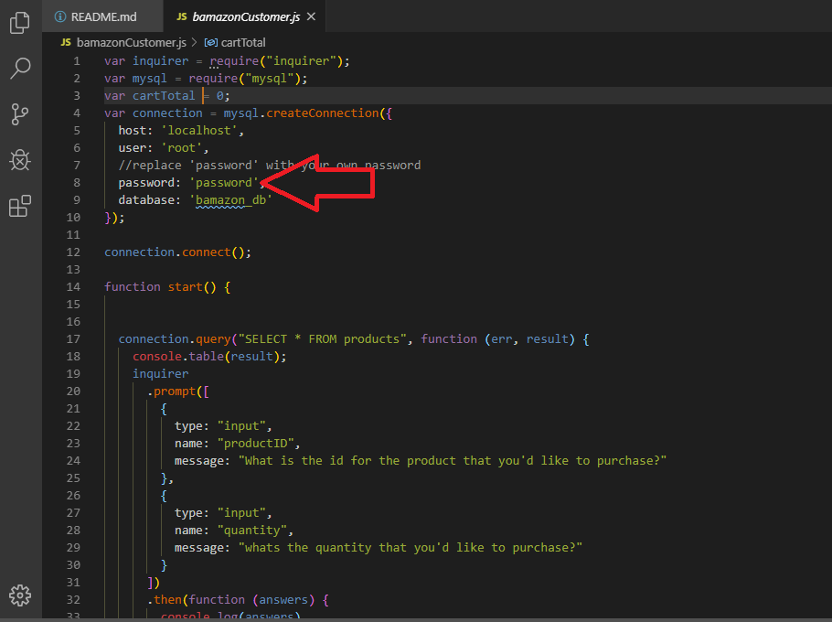
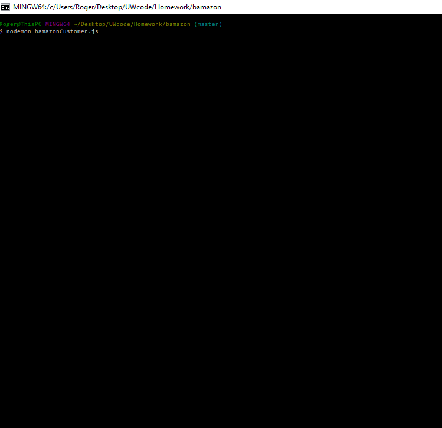
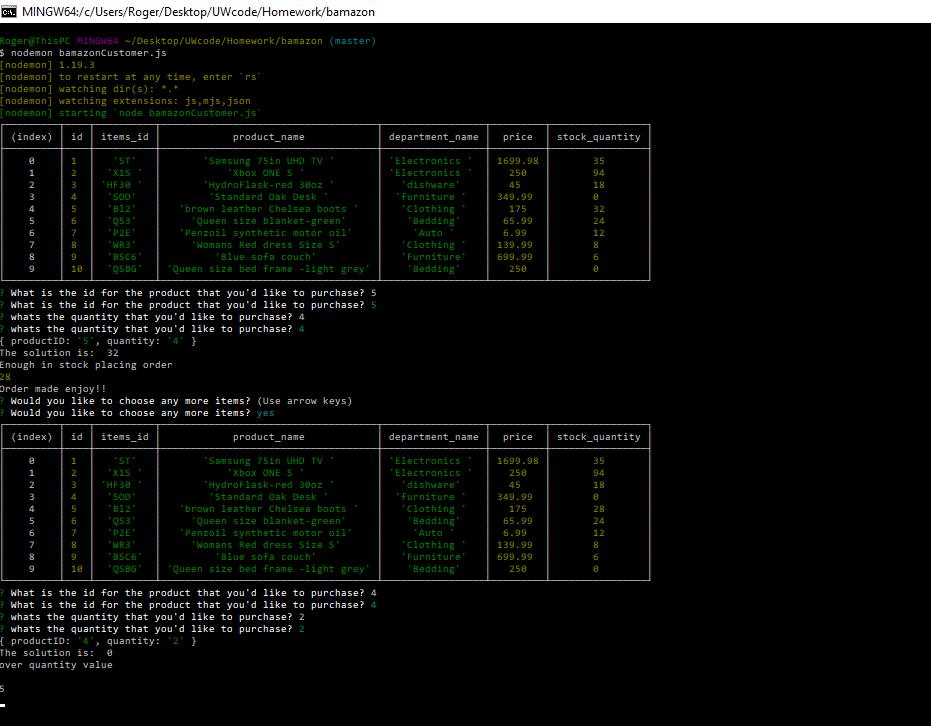

# Bamazon

### What is Bamazon
-Bamazon is a CLI application that allows you to take simulates online shopping and checkout experience through the terminal. 

### So Why Bamazon?
-The purpose of Bamazson's creation was demo the ability to use a data base and have the client interact with that database by simulating an online shopping experience.

### Installation Guide AND User Operation
1. You'll first need to download the required dependencies for this program by opening the terminal add typing out this command: `npm install`

2. Go to the `bamazonCustomer.js` file and replace the password field with your own password from MySQL

3. run the program by right clicking the `bamazonCustomer.js` file and select `open new Terminal` once the terminal opens up run this command in the terminal `node bamazonCustomer.js` then follow the on screen prompts from there on. (When the program starts up you'll be asked to input the item id. Use the id column no the items_id)

<!-- add demo images here -->
Update your password

How to run the program

How Program Looks Running

<!-- add demo images here -->

### Technologies Used In Creating This Application
    *Node.js
    *MyqSQL
    *Inquirer npm package
    
### Who Maintains And Contributes To The Project

The maintenance and development of this project is held solely responsible by "Rogelio Zavala"